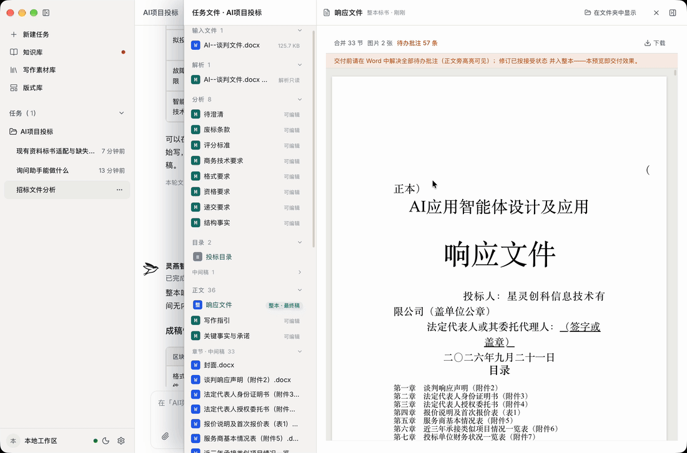
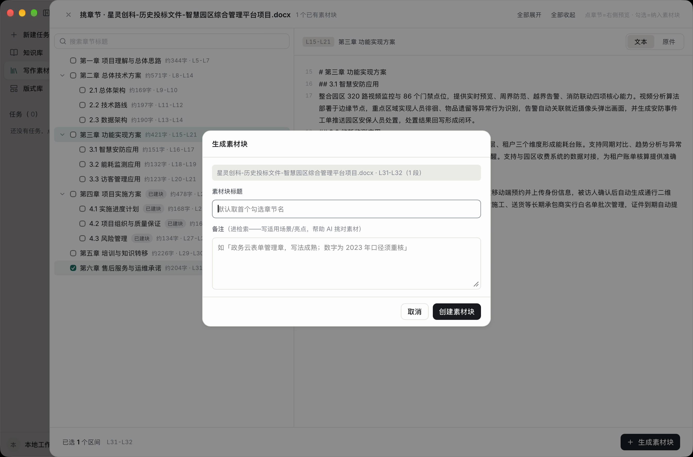
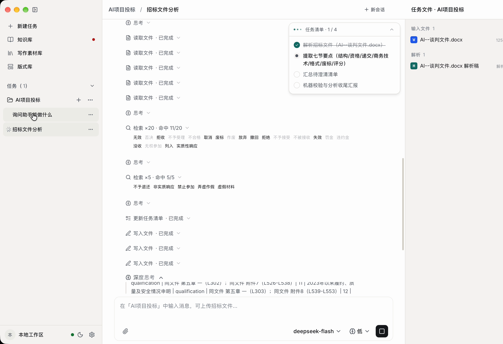
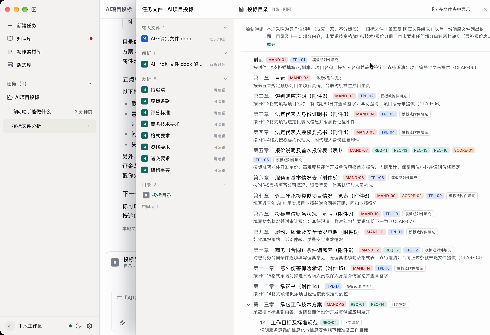
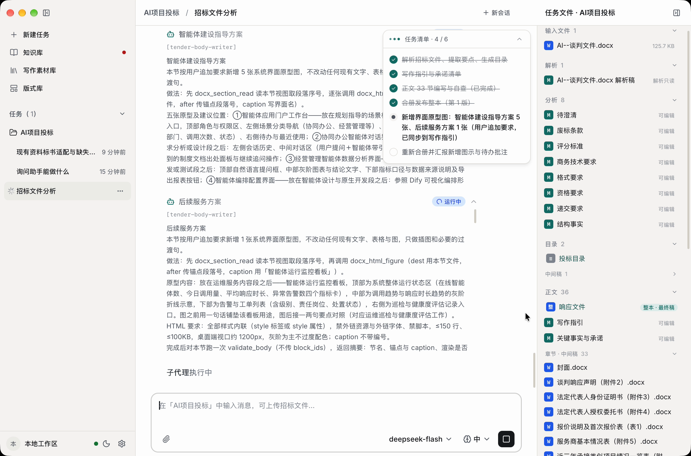
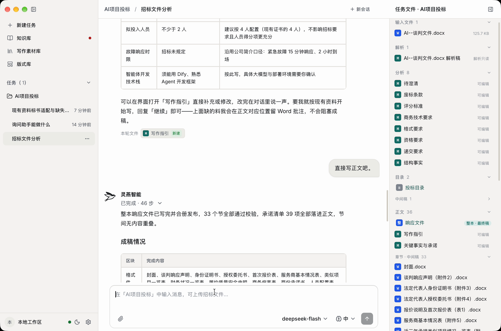
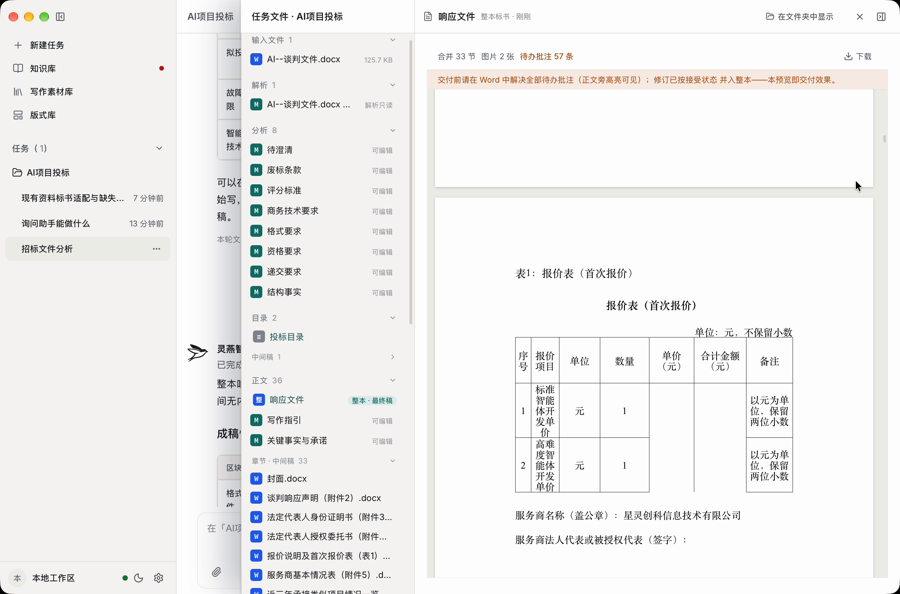
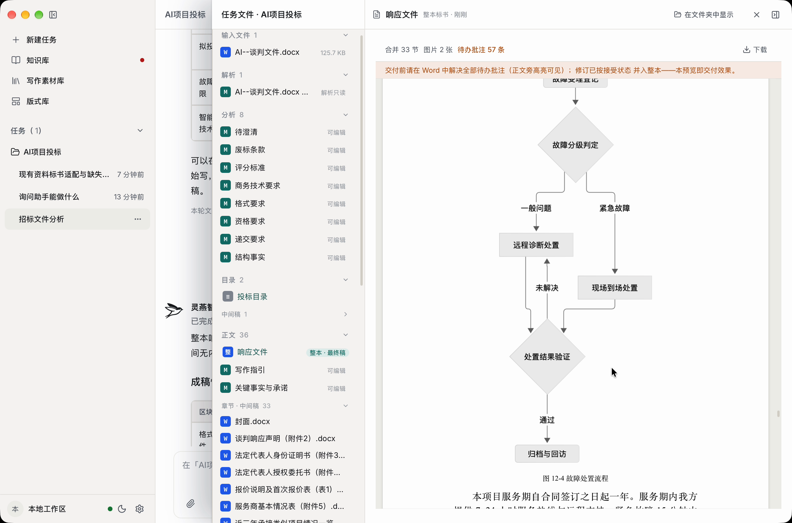
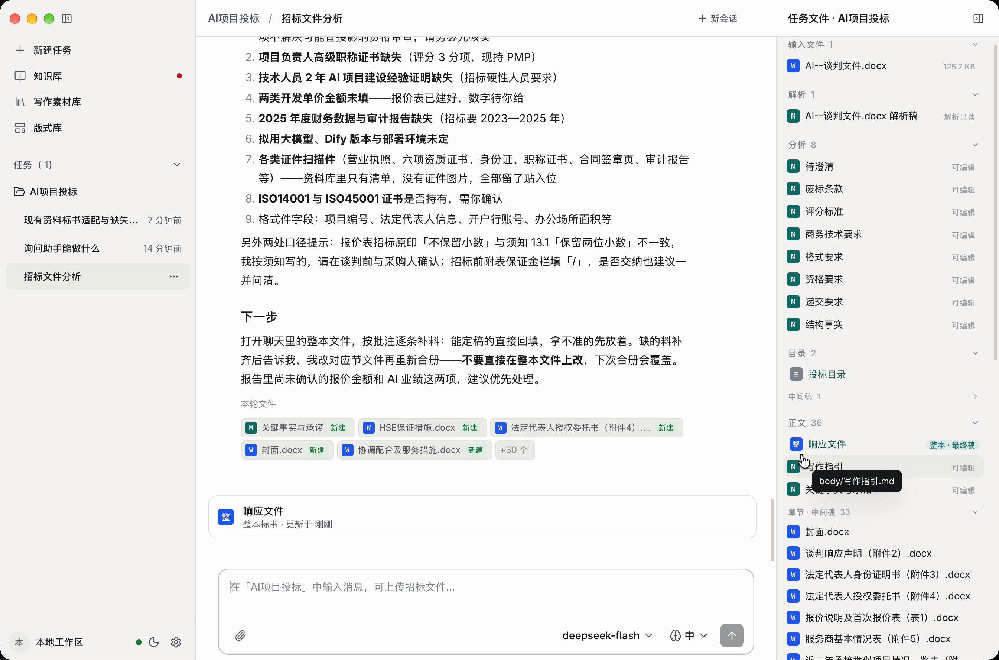

# 灵燕智能 LingYan Bid Agent

> 本地优先的 AI 标书协作助手 —— 把招标文件和企业资料，变成一份可核对、可审阅的投标文档。

**让每一份标书，都有依据地写。**

Local-first desktop AI agent for tender documents: evidence-linked section writing,
human-in-the-loop commitments, and a tracked-changes `.docx` as the deliverable.
Files stay on your machine, and you choose and configure the model service it calls.

[](https://github.com/joychin/LingYan-Bid-Agent/releases)
[](https://github.com/joychin/LingYan-Bid-Agent/releases)
[](LICENSE)

官网：<https://ddmdj.com>



## 这是什么

灵燕智能面向**投标专员**和**标书负责人**，服务完整的投标流程，不是一个聊天框：

- 招标文件不再靠人工逐页翻——原文被读成结构化资料，评分办法、资质要求、废标项、时间节点一条条提取出来；
- 写作不凭感觉——每一节都围绕评分项组织，关键内容标注招标原文出处；
- 交付不再是聊天框里的零散文字——产出带封面、目录、页码的标准 Word，AI 改动留修订痕迹，缺材料的地方标批注。

## 为什么做这个

写过标书的人都懂：

- **要求漏不起**——几百页招标文件，要求散落在正文、表格、附件里，人工很难一条不漏；
- **目录对不上评分**——响应结构和评分办法常常各写各的，评委找不到给分点，等于白写；
- **资料反复找**——资质、业绩、人员材料每次都要重新翻共享盘；
- **数字不敢信**——AI 顺手编出的工期、数量、案例，一旦写进标书就是实质性风险；
- **最后还得手搬**——调层级、加页码，交给谁审都费劲。

我们不帮你「一键生成」，而是陪你把每条要求都落到实处。

## 工作方式

**读原文 → 搭结构 → 写正文 → Word 交付**

| 步骤 | 做什么 | 原则 |
|------|--------|------|
| 01 读原文 | 解析 PDF、Word、文本及扫描件，识别章节、页码和原文位置；提取资质要求、评分办法、废标项、商务与技术要求、时间节点。支持主文件、补遗和答疑等多份来源 | 不从空白提示词开始 |
| 02 搭结构 | 围绕招标要求和评分办法建立投标目录，按评分项组织响应章节，检查是否遗漏关键要求，支持多册拆分与整体走查 | 每一节都有写作依据 |
| 03 写正文 | AI 负责整理、起草和查漏；关键要求、数字和结论尽量关联到招标原文的章节与页码；资料不足时明确提示待补，而不是编造成事实 | 不猜数字，不编承诺 |
| 04 Word 交付 | 输出标准 Word，带封面、目录、页码；AI 改过的留下修订痕迹，缺材料的地方标批注 | 最后一遍审核由你掌握 |

三处关键设计：

- **有出处。** 关键要求、数字和结论尽量关联到招标原文的章节、页码和行号；引用企业资料时同步标注来源文件与页码；找不到依据的内容标记为「待补」，而不是补全。
- **大事由人拍板。** 工期多久、质保几年、方案做几套——这些大事 AI 不会自己拍板，写到关键处会停下来问你；确认前不改正文。
- **Word 可审阅。** 目标是产出可继续处理的正式文档，而不是对话框里的一堆文字：支持封面、标题层级、表格、页码，AI 的每一处改动都留修订痕迹，待确认事项以批注提示。

## 企业资料库

资料不是一次性的「上传—生成—结束」，而是越用越顺手：

- **素材库**：历史标书里的好内容拆成素材，下次写作按章节直接调用；
- **知识库**：管理营业执照、资质证书、业绩案例、人员材料等证明文件，随时定位到手；
- **版式库**：沉淀单位常用的 Word 版式和标书格式，交付时直接套用。

素材不是整份文件丢进去——在历史标书的目录树上勾选章节区间，连同备注一起沉淀成素材块，写作时按章节直接调用：



## 界面速览

以下截图来自一次完整运行（演示项目与数据均为虚构）。一个任务就是一个投标项目——会话、解析稿、目录、成稿和原始招标文件都收在同一个任务里。


**读原文** —— 多份来源文件（主文件、补遗、答疑）一起解析，提取资质要求、评分办法、废标项与时间节点；「无效 / 否决 / 作废」这类废标风险词会自动反查原文，命中位置逐条可见：



**搭结构** —— 投标目录编辑器：每一节都挂着写作依据（必答 / 要求 / 评分 / 格式件），待澄清事项显式标出，不静默带过：



**写正文** —— 多节并发起草：写作子代理并行推进，每个节写到哪一步、用了哪些资料，过程全程可见：



**成稿** —— 整本合册发布前先过机器校验：下例中 33 个节全部通过校验、39 项承诺全部落进正文、节间无内容重叠：



**整本预览** —— 封面、报价表、流程图都是正式 Word 排版，全部在本地浏览器内渲染，文件不出本机：

<p align="center">
  
  
  
</p>

**收尾** —— 缺料、待澄清的事项以 Word 批注落在正文对应位置，收尾时按批注逐条点名补料，交付前逐条解决：



## 快速开始

### 下载安装

从 [Releases](https://github.com/joychin/LingYan-Bid-Agent/releases) 下载对应平台的安装包：

| 平台 | 安装包 |
|------|--------|
| Windows（x64） | `LingYan_<版本>_x64-setup.exe`（推荐）或 `LingYan_<版本>_x64_zh-CN.msi` |
| macOS（Apple Silicon） | `LingYan_<版本>_aarch64.dmg` |

Intel Mac 目前没有预编译包，请按下方「从源码运行 / 打包」自行构建。

安装包**未做代码签名**：macOS 首次打开被 Gatekeeper 拦截时，在访达中右键点应用选「打开」（或 `xattr -cr "/Applications/灵燕智能.app"`）；Windows 弹出 SmartScreen 提示时选「仍要运行」。

### 首次运行

1. 进入 **设置 → 模型 → 添加模型**，填入你的模型服务信息（OpenAI 兼容协议：接口地址、API Key、模型名）。用哪家服务由你决定，密钥只保存在本机；
2. （可选）在 **设置 → 文档解析** 配置百度云 OCR 密钥，用于解析扫描版招标文件；
3. 新建任务、上传一份招标文件，走一遍「读原文 → 搭目录 → 写一节 → 导 Word」。

### 从源码运行

需要 [Rust](https://rustup.rs/)、Node 22、[uv](https://docs.astral.sh/uv/)：

```bash
git clone https://github.com/joychin/LingYan-Bid-Agent.git
cd LingYan-Bid-Agent
npm install                            # 根目录开发依赖（Tauri CLI 等）
(cd frontend && npm install)           # 前端依赖
cp sidecar/.env.example sidecar/.env   # 环境变量模板（模型密钥也可在应用内配置）
./dev.sh browser                       # 浏览器模式开发，打开 http://localhost:5173
```

`./dev.sh` 不带参数是交互菜单，可选 `tauri`（完整客户端）/ `browser`（推荐）/ `sidecar` / `frontend` / `preview` / `stop`。两点注意：浏览器模式必须用 `localhost`，Vite 只绑 IPv6；不要让 `tauri` 与 `browser` 同时跑，两个 sidecar 共用 `agent.db` 会冲突。

改动后用 `./check.sh` 跑全栈检查（Python 测试与 lint、前端 lint/typecheck/test/build、Rust check/clippy）；自行构建安装包见 [docs/packaging.md](docs/packaging.md)。

## 技术栈

- **桌面壳**：Tauri 2（Rust），负责窗口、拉起并守护 sidecar；
- **前端**：React 19 + TypeScript + Vite + Tailwind v4；
- **后端 sidecar**：Python 3.12，FastAPI + DeepAgents/LangGraph + SQLite（FTS5 全文检索）；
- **方法论与提示词**：`sidecar/app/skills/` 下的 SKILL.md 与参考文档，属于仓库的一部分，可以单独阅读和改写。

打包时 Python 侧车由 PyInstaller 冻结随包分发；PyInstaller 无法跨 OS 交叉编译，各平台需在各自系统上构建（见 `docs/packaging.md`）。

## 安全与隐私

- **本地优先**：文件和工作区保存在你的电脑上（macOS 数据目录 `~/Library/Application Support/lingyan.ddmdj.com`）；
- **模型自己选、自己配**（BYOK）：使用哪家模型服务由你决定，密钥存在本机应用数据库（`app.db`，明文落盘，威胁模型与 `.env` 文件等同；不出现在任何云端）；
- **联网范围可控**：只有调用你启用的模型服务时需要联网，除此之外不额外上传资料。

## 常见问题

**AI 会自己编工期、数量和企业承诺吗？**
不会。工期、数量、承诺这些关键事项，系统写到一半会停下来问你。资料不够就标「待补」，不会替你编。

**支持哪些文件格式？**
招标文件支持 PDF、Word、文本及扫描件，并可同时处理主文件、补遗和答疑等多份来源。企业资料支持常见文档与图片格式。

**怎么开始用？**
下载后，拿一份你手边的真实招标文件走一遍：读原文、搭目录、写一节、导 Word。走完这一圈，你就知道它有没有用了。

## 使用的边界

灵燕智能用于**辅助**整理、起草和审阅投标材料。最终内容、承诺及投标责任，仍需由提交者审核并承担。

我们不承诺中标结果，也不提供不经人工审核就能直接提交的终稿。

## 参与贡献

问题与建议请提 [Issue](https://github.com/joychin/LingYan-Bid-Agent/issues)，欢迎把使用场景和踩坑记录下来。

## License

本项目以 [MIT](LICENSE) 协议开源，`sidecar/app/skills/` 中的方法论与提示词一并按 MIT 授权。

第三方组件保留各自的许可与署名（例如 `sidecar/app/skills/humanizer-zh/` 为第三方 MIT 作品，其 LICENSE 随文件放在同目录）。
